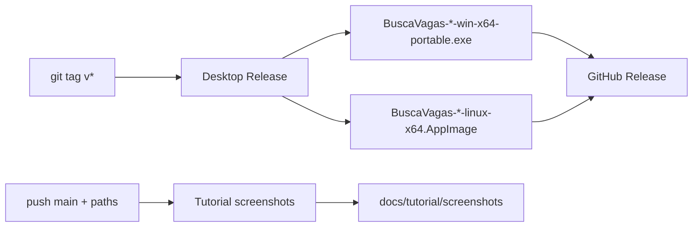

# Busca Vagas

App **local** para monitorar vagas no LinkedIn (pooling, filtros, notificações).

### Baixar

- **[Windows](https://github.com/caducatrinck/busca-vagas/releases/download/v1.0.2/BuscaVagas-1.0.2-win-x64-portable.exe)** — `BuscaVagas-1.0.2-win-x64-portable.exe`
- **[Linux](https://github.com/caducatrinck/busca-vagas/releases/download/v1.0.2/BuscaVagas-1.0.2-linux-x64.AppImage)** — `BuscaVagas-1.0.2-linux-x64.AppImage`  
  (`chmod +x` no AppImage se o sistema pedir)

Outras versões: **[Releases](https://github.com/caducatrinck/busca-vagas/releases)**

Tutorial com prints: **[docs/tutorial](./docs/tutorial/README.md)**

### Stack e por quê

| Tecnologia | Papel | Por quê |
|------------|--------|---------|
| **Electron** | App desktop (Windows portable / Linux AppImage) | Empacota UI + API no PC, bandeja, notificações e auto-update sem depender de navegador aberto |
| **React + Vite** | Interface | UI rápida de desenvolver e empacotar; hot reload no dia a dia |
| **Fastify** | API local | Servidor HTTP leve embutido no desktop: buscas, store, pooling |
| **Cheerio** | Parsing HTML do LinkedIn | Extrai listagem/detalhe sem browser headless pesado |
| **electron-builder** | Empacote / release | Gera o `.exe` portable e o AppImage a partir do mesmo código |

O shell desktop é **Electron** (não Tauri).

### Dados

Ficam só na sua máquina:
- Windows: `%AppData%/Busca Vagas/data/`
- Linux: `~/.config/Busca Vagas/data/`

Use **Exportar / Importar** no topo do app para backup.

### Aviso

Uso pessoal/local. Scraping do LinkedIn pode conflitar com os [Termos de Uso](https://www.linkedin.com/legal/user-agreement). Use o **seu** cookie e a **sua** conta.

---

## Desenvolvimento

Guia de rodar com Node/Docker: **[docs/dev.md](./docs/dev.md)**  
Instalação do zero (Git/Node): **[INSTALACAO-DO-ZERO.md](./INSTALACAO-DO-ZERO.md)**  
Empacotar desktop / releases: **[DESKTOP.md](./DESKTOP.md)**  
Tutorial EN: **[docs/tutorial/README.en.md](./docs/tutorial/README.en.md)**

### Pipeline automatizada

- Tag `v*` (versão = `desktop/package.json`) → workflow *Desktop Release* → artefatos Windows/Linux
- Push na `main` (web/api/e2e/docs) → *Tutorial screenshots* → prints em `docs/tutorial/screenshots`

Stack de CI usada nessa pipeline: **GitHub Actions**, **Playwright**.
