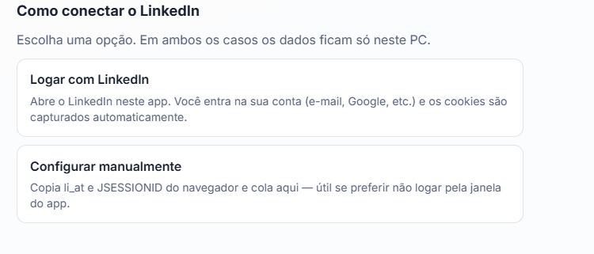
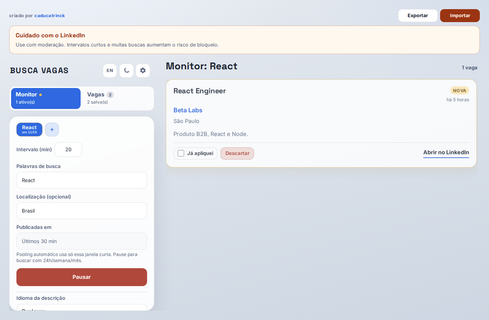
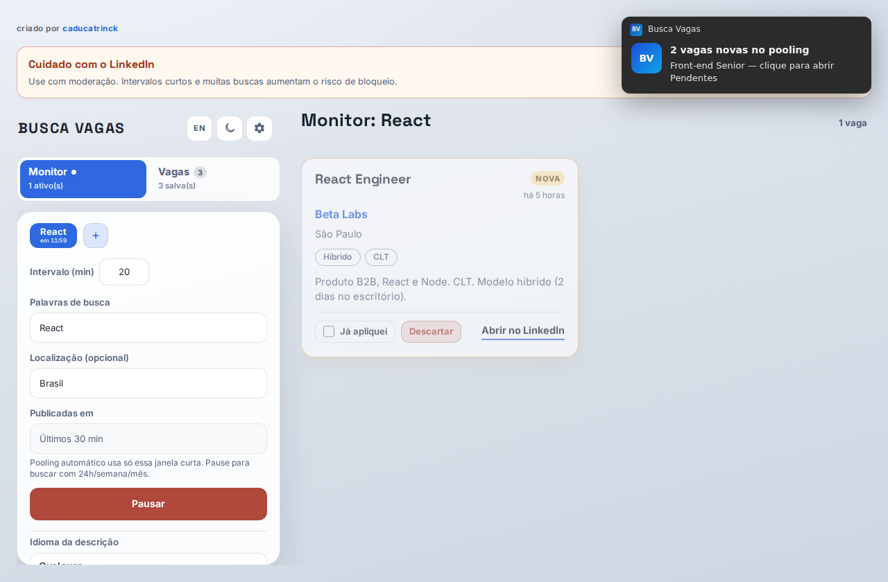
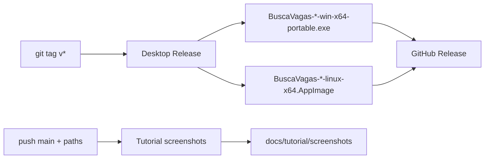

# Busca Vagas

English guide: **[docs/tutorial/README.en.md](./docs/tutorial/README.en.md)**

App **local** para monitorar vagas no LinkedIn (pooling, filtros, notificações).

### Baixar

- **[Windows](https://github.com/caducatrinck/busca-vagas/releases/download/v1.0.8/BuscaVagas-1.0.8-win-x64-portable.exe)** — `BuscaVagas-1.0.8-win-x64-portable.exe`
- **[Linux](https://github.com/caducatrinck/busca-vagas/releases/download/v1.0.8/BuscaVagas-1.0.8-linux-x64.AppImage)** — `BuscaVagas-1.0.8-linux-x64.AppImage`  
  (`chmod +x` no AppImage se o sistema pedir)
- **macOS** — ainda **não** há `.dmg` nos Releases. No Mac você roda a partir do código (Git + Node), passo a passo: **[INSTALACAO-MAC.md](./INSTALACAO-MAC.md)**

Outras versões: **[Releases](https://github.com/caducatrinck/busca-vagas/releases)**

Tutorial com prints: **[docs/tutorial](./docs/tutorial/README.md)**

Na primeira abertura você conecta o LinkedIn no app (**Entrar com LinkedIn**) ou cola os cookies manualmente:

### Stack e por quê

| Tecnologia | Papel | Por quê |
|------------|--------|---------|
| **Electron** | App desktop (Windows portable / Linux AppImage; Mac via código) | Empacota UI + API no PC, bandeja, notificações e auto-update sem depender de navegador aberto |
| **React + Vite** | Interface | UI rápida de desenvolver e empacotar; hot reload no dia a dia |
| **Fastify** | API local | Servidor HTTP leve embutido no desktop: buscas, store, pooling |
| **Cheerio** | Parsing HTML do LinkedIn | Extrai listagem/detalhe sem browser headless pesado |
| **electron-builder** | Empacote / release | Gera o `.exe` portable e o AppImage a partir do mesmo código |

### Dados

Ficam só na sua máquina:
- Windows: `%AppData%/Busca Vagas/data/`
- Linux: `~/.config/Busca Vagas/data/`
- macOS (app empacotado): `~/Library/Application Support/Busca Vagas/data/`
- macOS (rodando pelo código): pasta `api/data/` no clone — ver **[INSTALACAO-MAC.md](./INSTALACAO-MAC.md)**

Use **Exportar / Importar** no topo do app para backup.

### Aviso (importante)

Este projeto é **experimental**, para uso **pessoal e local** no seu próprio PC.

Ele automatiza consultas de vagas no LinkedIn com a **sua** sessão (cookie / login no app). Isso **conflita** com o [Contrato do Usuário do LinkedIn](https://br.linkedin.com/legal/user-agreement) — em especial a seção **8.2** (proibição de desenvolver/usar meios para extrair dados e de métodos automatizados não autorizados) — e com a política de [software proibido](https://www.linkedin.com/help/linkedin/answer/a1341387).

**Riscos (você assume):**
- bloqueios técnicos (rate limit / sessão inválida)
- o LinkedIn pode tomar outras medidas que considerar adequadas ao Contrato

**Não faça:**
- usar cookie/conta de outra pessoa
- revender, hospedar como serviço ou extrair dados em massa para terceiros
- tratar este repo como “aprovado” ou “oficial” pelo LinkedIn

O código é público só como referência de projeto open source. **Não somos afiliados ao LinkedIn.**

---

## Desenvolvimento

Guia de rodar com Node/Docker: **[docs/dev.md](./docs/dev.md)**  
Instalação do zero (Git/Node): **[INSTALACAO-DO-ZERO.md](./INSTALACAO-DO-ZERO.md)**  
**macOS** (passo a passo na máquina): **[INSTALACAO-MAC.md](./INSTALACAO-MAC.md)**  
Empacotar desktop / releases: **[DESKTOP.md](./DESKTOP.md)**

### Pipeline automatizada

- Tag `v*` (versão = `desktop/package.json`) → workflow *Desktop Release* → artefatos Windows/Linux
- Push na `main` (web/api/e2e/docs) → *Tutorial screenshots* → prints em `docs/tutorial/screenshots`

Stack de CI usada nessa pipeline: **GitHub Actions**, **Playwright**.

---
