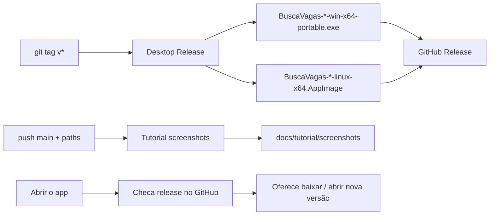

# Busca Vagas

  <a href="#português"><strong>🇧🇷 Português</strong></a>
  &nbsp;&nbsp;|&nbsp;&nbsp;
  <a href="#english"><strong>🇺🇸 English</strong></a>

App **local** para monitorar vagas no LinkedIn (pooling, filtros, notificações).  
Roda no seu PC — sem instalar Git nem Node.

---

## Português

### Stack e por quê

| Tecnologia | Papel | Por quê |
|------------|--------|---------|
| **Electron** | App desktop (Windows portable / Linux AppImage) | Empacota UI + API no PC, bandeja, notificações e auto-update sem depender de navegador aberto |
| **React + Vite** | Interface | UI rápida de desenvolver e empacotar; hot reload no dia a dia |
| **TypeScript** | Linguagem | Tipagem compartilhada entre web, API e domínio (filtros, monitores, vagas) |
| **Fastify** | API local | Servidor HTTP leve embutido no desktop: buscas, store, pooling |
| **Cheerio** | Parsing HTML do LinkedIn | Extrai listagem/detalhe sem browser headless pesado |
| **electron-builder** | Empacote / release | Gera o `.exe` portable e o AppImage a partir do mesmo código |
| **GitHub Actions** | CI/CD | Release na tag; screenshots do tutorial no push da `main` |
| **Playwright** | Screenshots E2E | Gera os prints do tutorial de forma repetível |
| **npm workspaces** | Monorepo (`web`, `api`, `desktop`) | Um `npm ci` e scripts únicos para dev, test e dist |

Não usamos Tauri: o shell desktop é **Electron**.

### Pipeline automatizada

1. **Release desktop** — push de tag `v*` (versão = `desktop/package.json`) → workflow *Desktop Release* → artefatos Windows/Linux na [Releases](https://github.com/caducatrinck/busca-vagas/releases)
2. **Tutorial** — push na `main` (web/api/e2e/docs) → *Tutorial screenshots* → atualiza prints em `docs/tutorial/screenshots`
3. **Auto-update** — ao abrir, o app consulta a release mais recente e pergunta se você quer baixar

### Baixar e abrir

1. Abra a página de [**Releases**](https://github.com/caducatrinck/busca-vagas/releases/latest)
2. Baixe o arquivo da sua plataforma:
   - **Windows:** `BuscaVagas-*-win-x64-portable.exe`
   - **Linux:** `BuscaVagas-*-linux-x64.AppImage`
3. Abra o arquivo  
   - No Linux: `chmod +x BuscaVagas-*-linux-x64.AppImage` e depois execute
4. Siga as instruções **dentro do app** (Configurações → cookie do LinkedIn)

Não precisa de instalação: o Windows é portable; o Linux é AppImage.

### Como usar (resumo)

| Passo | O que fazer |
|-------|-------------|
| 1 | Configure o cookie nas **Configurações** (o app explica na tela) |
| 2 | Aba **Monitor** → `+` → monte a busca |
| 3 | **Buscar agora** (liga o pooling) |
| 4 | Veja vagas em **Vagas**; o app pode notificar e ficar na bandeja |

Tutorial com prints: **[docs/tutorial](./docs/tutorial/README.md)** · [English guide](./docs/tutorial/README.en.md)

### Atualização

Ao abrir, o app avisa se existir versão nova no GitHub. Você escolhe se quer baixar.

### Dados

Ficam só na sua máquina:
- Windows: `%AppData%/Busca Vagas/data/`
- Linux: `~/.config/Busca Vagas/data/`

Use **Exportar / Importar** no topo do app para backup.

### Aviso

Uso pessoal/local. Scraping do LinkedIn pode conflitar com os [Termos de Uso](https://www.linkedin.com/legal/user-agreement). Use o **seu** cookie e a **sua** conta.

### Para quem desenvolve / faz PR

Guia de rodar com Node/Docker: **[docs/dev.md](./docs/dev.md)**  
Instalação do zero (Git/Node): **[INSTALACAO-DO-ZERO.md](./INSTALACAO-DO-ZERO.md)**  
Empacotar desktop / releases: **[DESKTOP.md](./DESKTOP.md)**

[↑ Topo](#busca-vagas) · [English ↓](#english)

---

## English

Local LinkedIn job monitor (pooling, filters, notifications).  
Runs on your PC — no Git or Node required.

### Stack and why

| Tech | Role | Why |
|------|------|-----|
| **Electron** | Desktop app (Windows portable / Linux AppImage) | Ships UI + API on your machine, tray, notifications, auto-update — no browser left open |
| **React + Vite** | UI | Fast UI iteration and packaging; hot reload in day-to-day work |
| **TypeScript** | Language | Shared types across web, API, and domain (filters, monitors, jobs) |
| **Fastify** | Local API | Lightweight HTTP server embedded in the desktop app: searches, store, pooling |
| **Cheerio** | LinkedIn HTML parsing | Listing/detail extraction without a heavy headless browser |
| **electron-builder** | Packaging / release | Builds the portable `.exe` and AppImage from the same codebase |
| **GitHub Actions** | CI/CD | Release on tag; tutorial screenshots on `main` push |
| **Playwright** | E2E screenshots | Repeatable tutorial screenshots |
| **npm workspaces** | Monorepo (`web`, `api`, `desktop`) | One `npm ci` and shared scripts for dev, test, and dist |

We do **not** use Tauri — the desktop shell is **Electron**.

### Automated pipeline

1. **Desktop release** — push tag `v*` (must match `desktop/package.json`) → *Desktop Release* workflow → Windows/Linux assets on [Releases](https://github.com/caducatrinck/busca-vagas/releases)
2. **Tutorial** — push to `main` (web/api/e2e/docs) → *Tutorial screenshots* → updates `docs/tutorial/screenshots`
3. **Auto-update** — on launch, the app checks the latest GitHub release and offers download

### Download and open

1. Open **[Releases](https://github.com/caducatrinck/busca-vagas/releases/latest)**
2. Download for your OS:
   - **Windows:** `BuscaVagas-*-win-x64-portable.exe`
   - **Linux:** `BuscaVagas-*-linux-x64.AppImage`
3. Open the file  
   - On Linux: `chmod +x BuscaVagas-*-linux-x64.AppImage`, then run it
4. Follow the steps **inside the app** (Settings → LinkedIn cookie)

No installer needed: Windows portable / Linux AppImage.

### How to use (short)

| Step | What to do |
|------|------------|
| 1 | Set the cookie in **Settings** (the app explains on screen) |
| 2 | **Monitor** tab → `+` → set up the search |
| 3 | **Search now** (enables pooling) |
| 4 | Check **Jobs**; the app can notify and stay in the tray |

Illustrated guide: **[docs/tutorial (PT)](./docs/tutorial/README.md)** · **[English](./docs/tutorial/README.en.md)**

### Updates

On launch, the app can offer a newer GitHub release. You choose whether to download.

### Data

Stored only on your machine (`%AppData%/Busca Vagas/data/` on Windows, `~/.config/Busca Vagas/data/` on Linux). Use **Export / Import** in the app for backups.

### Disclaimer

Personal/local use. Scraping may conflict with LinkedIn’s [User Agreement](https://www.linkedin.com/legal/user-agreement). Use **your** cookie and account.

### For contributors

Local Node/Docker: **[docs/dev.md](./docs/dev.md)** · From-scratch setup: **[INSTALACAO-DO-ZERO.md](./INSTALACAO-DO-ZERO.md)** · Desktop packaging: **[DESKTOP.md](./DESKTOP.md)**

[↑ Top](#busca-vagas) · [Português ↑](#português)
