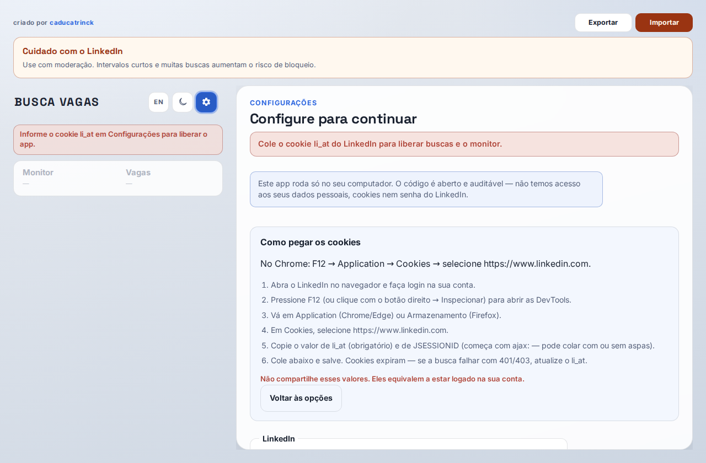
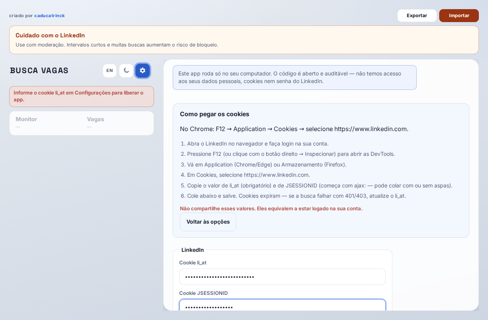
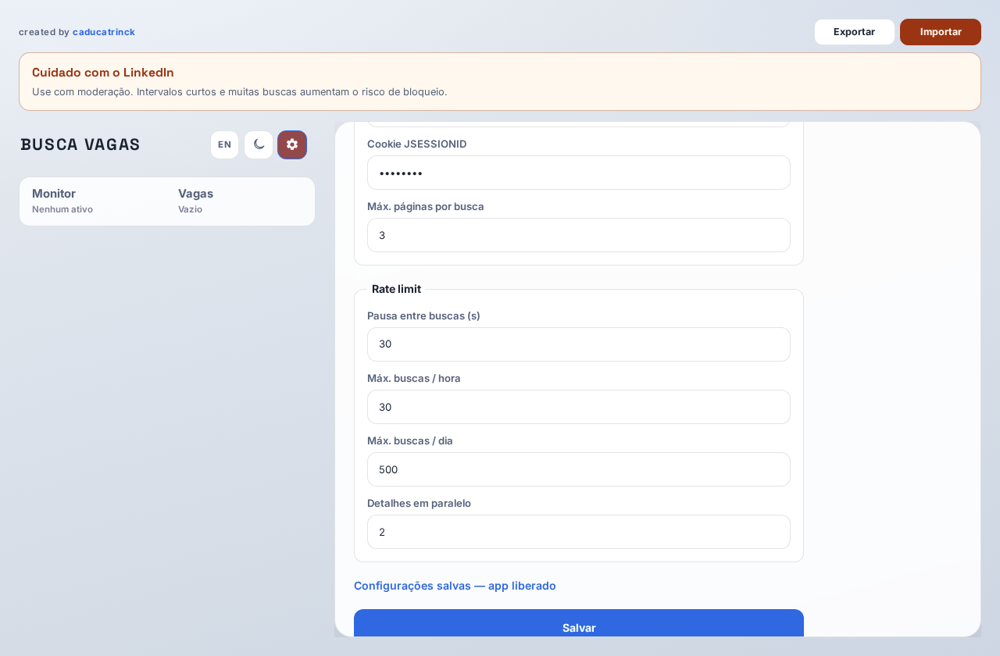
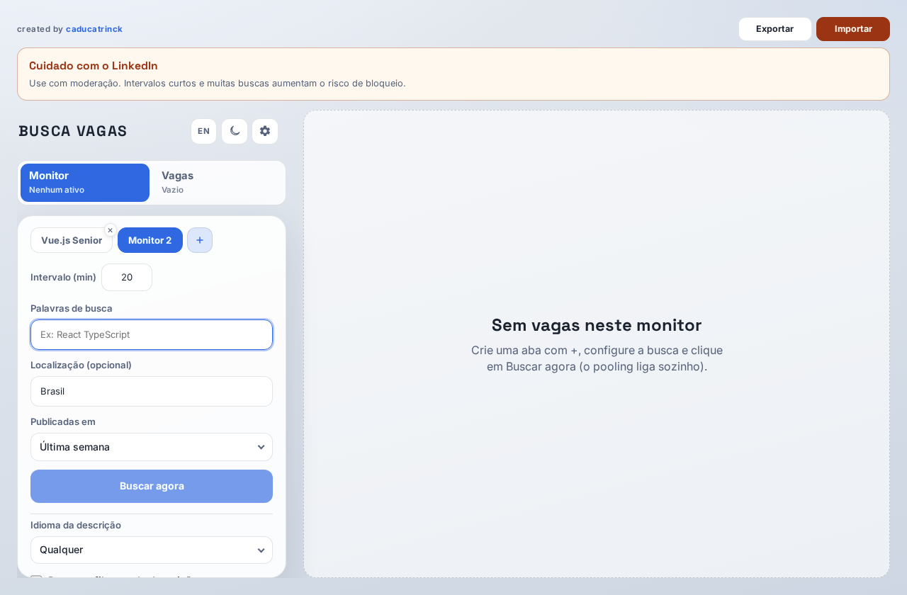
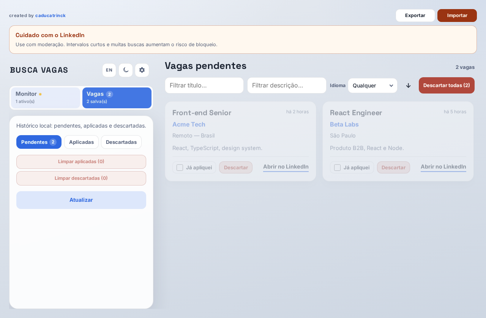
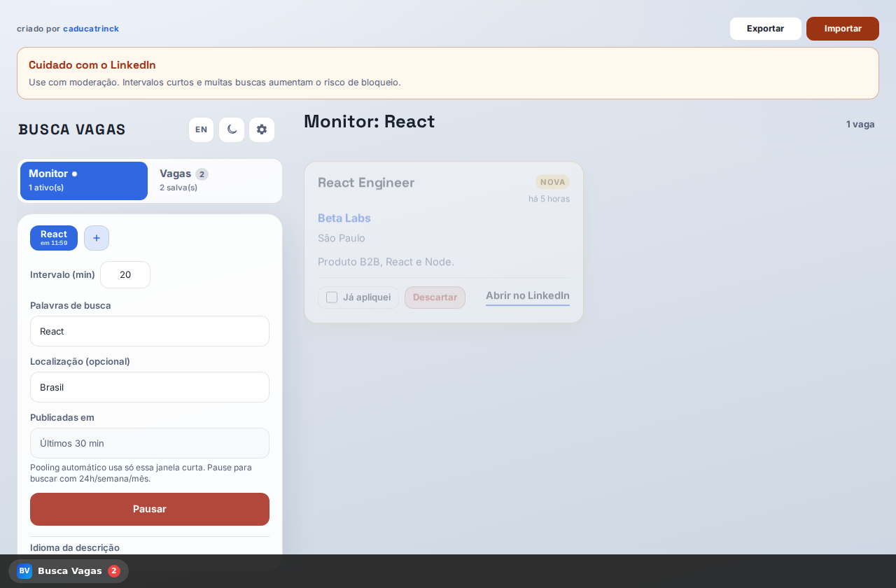

# How to download and use

  <a href="./README.md"><strong>🇧🇷 Português</strong></a>
  &nbsp;&nbsp;|&nbsp;&nbsp;
  <a href="./README.en.md"><strong>🇺🇸 English</strong></a>

## Why Busca Vagas?

LinkedIn does not reliably notify you when a new job matches the search you care about. This app:

1. **Pooling** — repeats your search on the interval you set (e.g. every 20 minutes), with a short window aligned to pooling
2. **Tray** — closing the window does not quit; the app stays in the system tray
3. **Notification** — when a new job appears, the OS can notify you (even with the window closed)

The screenshot below is the everyday outcome that matters:

---

## 1. Download

1. Open [Releases](https://github.com/caducatrinck/busca-vagas/releases/latest)
2. Download for your platform:
   - Windows: `BuscaVagas-*-win-x64-portable.exe`
   - Linux: `BuscaVagas-*-linux-x64.AppImage`
   - **macOS:** no installer in Releases yet — follow **[INSTALACAO-MAC.md](../../INSTALACAO-MAC.md)** (Git + Node, step by step; Portuguese)
3. Open the file (on Linux, allow execution if the OS asks)

## 2. Connect LinkedIn

On first launch the app asks you to connect LinkedIn. Pick one option (data stays on this PC only):

1. **Sign in with LinkedIn** — LinkedIn-style blue button; opens the in-app login window (email, Google, Microsoft, Apple…). When you finish, the session is saved automatically
2. **Configure manually** — paste `li_at` and `JSESSIONID` from the browser

### Option A — Sign in with LinkedIn

Click **Sign in with LinkedIn** and sign in in the window that opens. There is no extra step: the button starts login right away. When the session is captured, login windows close and searches/monitor unlock.

### Option B — Manual

Follow the in-app guide (F12 → Application → Cookies) and paste `li_at` and `JSESSIONID`.

## 3. Create a monitor

**Monitor** → **+** → fill in the search (keywords, location, posted window).

## 4. Pooling

**Search now** enables pooling. **Pause** turns it off. While active, the tab shows the countdown to the next round.

## 5. Jobs

**Jobs** → Pending (then applied / discarded). Filter by title/description and bulk-discard if you want.

## 6. Notification and tray

With pooling on, the app can notify new jobs. Closing the window keeps the app in the tray — pooling continues.

## Updates

On launch, if a newer GitHub release exists, the app asks whether you want to download it (release pipeline via `v*` tags).

## Common issues

| Situation | What to do |
|-----------|------------|
| Search fails / 401 | In Settings, **Sign in to LinkedIn again** or refresh the cookies |
| Linux won’t open | `chmod +x` on the AppImage |
| Backup | **Export / Import** at the top of the app |

Contributors: [dev.md](../dev.md)
