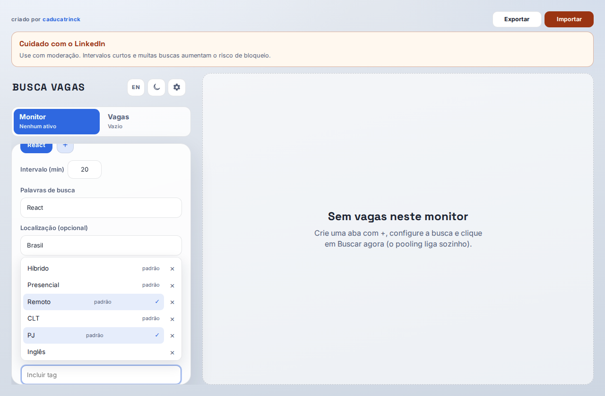
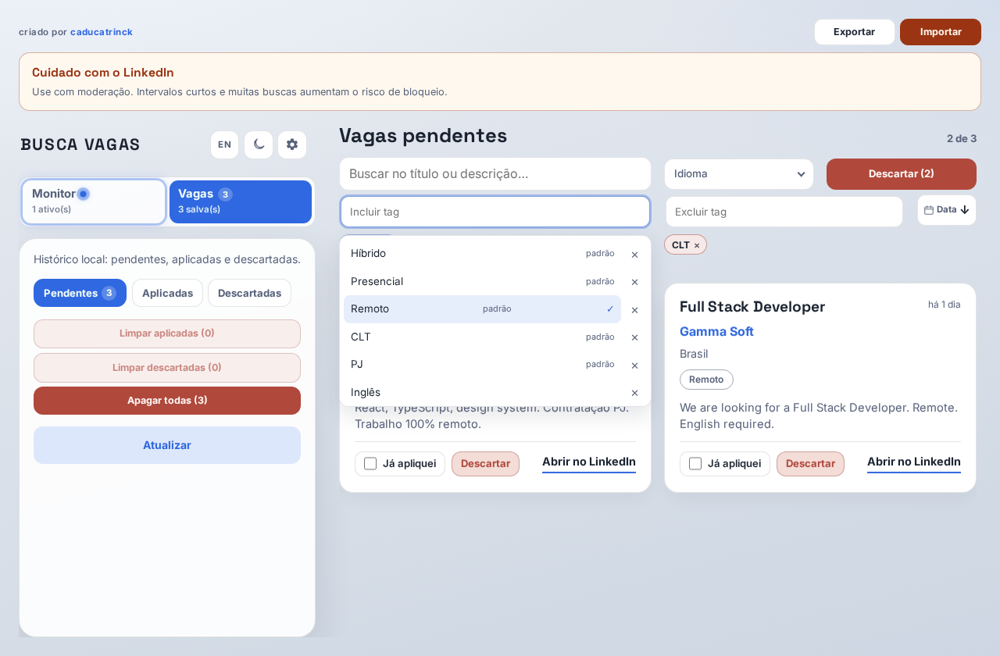

# Como baixar e usar

  <a href="./README.md"><strong>🇧🇷 Português</strong></a>
  &nbsp;&nbsp;|&nbsp;&nbsp;
  <a href="./README.en.md"><strong>🇺🇸 English</strong></a>

## Por quê usar o Busca Vagas?

O LinkedIn não avisa com confiabilidade quando entra uma vaga nova na busca que você montou. O app:

1. **Pooling** — repete a busca no intervalo que você definir (ex.: a cada 20 min), com janela curta alinhada ao pooling
2. **Bandeja** — fechar a janela não mata o app; ele continua na bandeja do sistema
3. **Notificação** — quando aparece vaga nova, o SO pode avisar (mesmo com a janela fechada)

O print abaixo é o resultado que importa no dia a dia — **notificação de vaga nova** no canto da tela, com o monitor rodando:

---

## 1. Baixar

1. Abra [Releases](https://github.com/caducatrinck/busca-vagas/releases/latest)
2. Baixe o arquivo da sua plataforma:
   - Windows: `BuscaVagas-*-win-x64-portable.exe`
   - Linux: `BuscaVagas-*-linux-x64.AppImage`
   - **macOS:** ainda não há instalável nos Releases — use o guia **[INSTALACAO-MAC.md](../../INSTALACAO-MAC.md)** (Git + Node, passo a passo)
3. Abra o arquivo (no Linux, permita execução se o sistema pedir)

## 2. Configurar o LinkedIn

Na primeira abertura o app pede para conectar o LinkedIn. Escolha uma opção (os dados ficam só neste PC):

1. **Entrar com LinkedIn** — botão azul no estilo LinkedIn; abre a janela de login no app (e-mail, Google, Microsoft, Apple…). Ao concluir, a sessão é salva sozinha
2. **Configurar manualmente** — cola `li_at` e `JSESSIONID` do navegador

**Tela inicial de conexão** — duas opções lado a lado: login no app ou configuração manual.

### Opção A — Entrar com LinkedIn

Clique em **Entrar com LinkedIn** e faça login na janela que abrir. Não há etapa intermediária: o botão já inicia o login. Quando a sessão for capturada, as janelas fecham e o app libera buscas e monitor.

### Opção B — Manual

**Caminho manual** — depois de clicar em “Configurar manualmente”, o app mostra o guia para pegar os cookies no navegador.

Siga o guia no app (F12 → Application → Cookies) e cole `li_at` e `JSESSIONID`.

**Campos de cookie** — cole `li_at` e `JSESSIONID` e salve.

**Configuração salva** — confirmação de que a sessão está pronta para buscar.

## 3. Criar um monitor

**Monitor** → **+** → preencha a busca (palavras, local, janela de publicação).

**Novo monitor** — aba com a query (ex.: “Vue.js Senior”), localização e demais filtros da busca.

## 4. Pooling

**Buscar agora** liga o pooling. **Pausar** desliga. Enquanto ativo, a aba mostra a contagem para a próxima rodada.

**Pooling ligado** — a aba Monitor fica destacada e exibe o tempo até a próxima busca automática.

## 5. Vagas

**Vagas** → Pendentes (depois aplicadas / descartadas). Filtre por título/descrição e descarte em lote se quiser.

**Lista de pendentes** — vagas encontradas pelo pooling; dá para marcar aplicadas, descartar ou abrir no LinkedIn.

## 6. Tags (incluir / excluir)

Tags filtram e também **descartam automaticamente** no pooling. Há tags prontas (Remoto, Híbrido, Presencial, CLT, PJ) e você pode **criar as suas** (ex.: Inglês).

### No Monitor

No painel do monitor use:

- **Incluir tag** — a vaga precisa casar com **pelo menos uma** (OR). Sem seleção = aceita todas
- **Excluir tag** — se casar com **qualquer** uma, a vaga é descartada

Exemplo: incluir `Remoto` + `PJ` e excluir `Presencial`.

**Tags no monitor** — menu “Incluir tag” aberto; tags marcadas (ex.: Remoto, PJ) entram no filtro e no auto-descarte do pooling.

### Na aba Vagas

Os mesmos campos filtram a lista (Pendentes / Aplicadas / Descartadas), sem mudar o pooling.

**Tags na aba Vagas** — incluir/excluir no topo da lista; só aparecem as vagas que passam no filtro (ex.: Remoto, sem CLT).

### Dicas

1. Clique no campo → escolha uma tag da lista (ou digite e **Criar “…”**)
2. Várias tags de incluir = OR (basta uma)
3. Tag de excluir tem prioridade: se bater, some da lista / vai para Descartadas no pooling
4. Na aba Descartadas, filtre (ex.: inglês) e use **Excluir (n)** para apagar de vez as filtradas

## 7. Notificação e bandeja

Com pooling ativo o app pode notificar vagas novas. Fechar a janela mantém o app na bandeja — o pooling segue.

**Notificação do sistema** — aviso quando entra vaga nova, mesmo com a janela do app fechada.

**Bandeja** — o ícone do Busca Vagas fica na bandeja; fechar a janela não encerra o pooling.

## Atualizar

Ao abrir, se houver versão nova no GitHub, o app pergunta se você quer baixar (pipeline de release por tag `v*`).

## Problemas comuns

| Situação | O que fazer |
|----------|-------------|
| Busca falha / 401 | Em Configurações, **Entrar de novo no LinkedIn** ou atualize os cookies |
| Linux não abre | `chmod +x` no AppImage |
| Backup | **Exportar / Importar** no topo do app |

Contribuidores: [dev.md](../dev.md)
